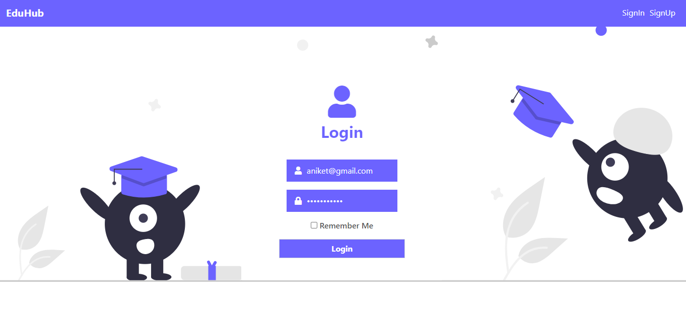
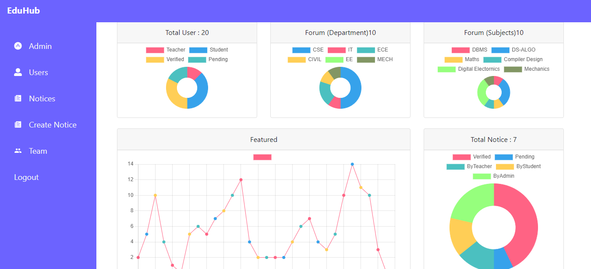
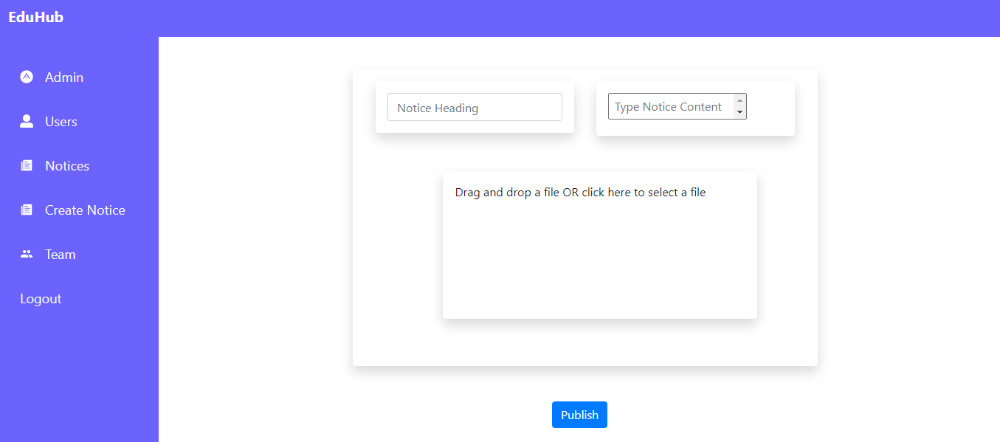
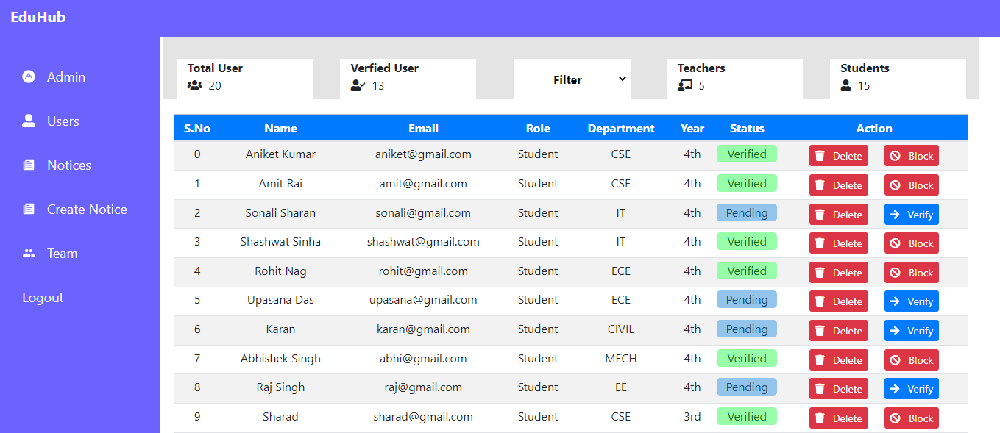
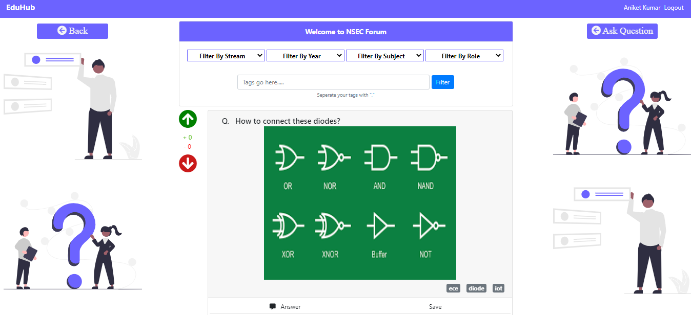
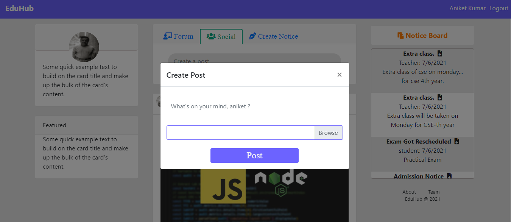
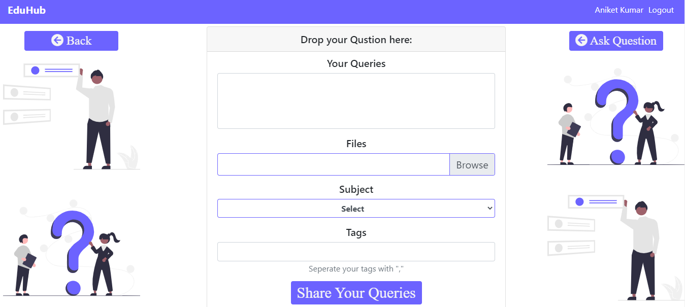
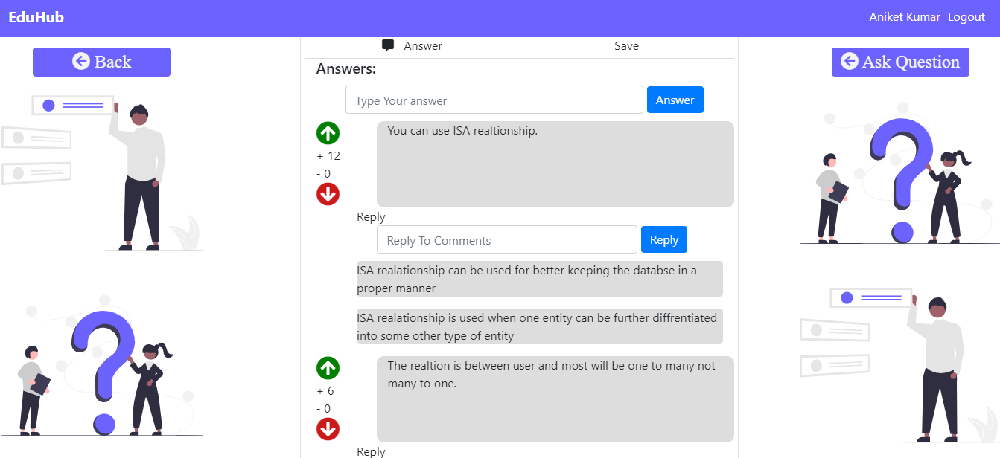

# EduHub

A Social Network developed with MERN stack.

<p align="center">
 
&nbsp; &nbsp;
 
</p>

<p align="center">
 
&nbsp; &nbsp;
 
</p>

<p align="center">
 
&nbsp; &nbsp;
 
</p>

<p align="center">
 
&nbsp; &nbsp;
 
</p>


## Requirements

1. nodeJS >=14.15.4
2. npm >=6.14.10
3. mongodb

## Steps to init project

1.  First install all dependencies with npm:
    `npm install` in the root directory && `npm install` in the server directory.
2.  Create a `.env` file and insert the following code. Replace values with yours!!

    ```javascript
    DATABASE = "mongodb://localhost/eduhub";
    SECRET_ADMIN_AUTH_KEY = "adminkey";
    SECRET_STUDENT_AUTH_KEY = "studentkey";
    SECRET_TEACHER_AUTH_KEY = "teacherkey";
    ```

3. ### Create a folder in ./server directory and name it as
    `files`

4.  ### Start the server for backend and frontend
    ### For frontend
    `npm start` in the root directory
    ### For backend
    Go to the server directory and run the command `npm start`
5.  Now load the app

    ```javacript
    localhost:3000
    ```

6.  Enjoy!!
